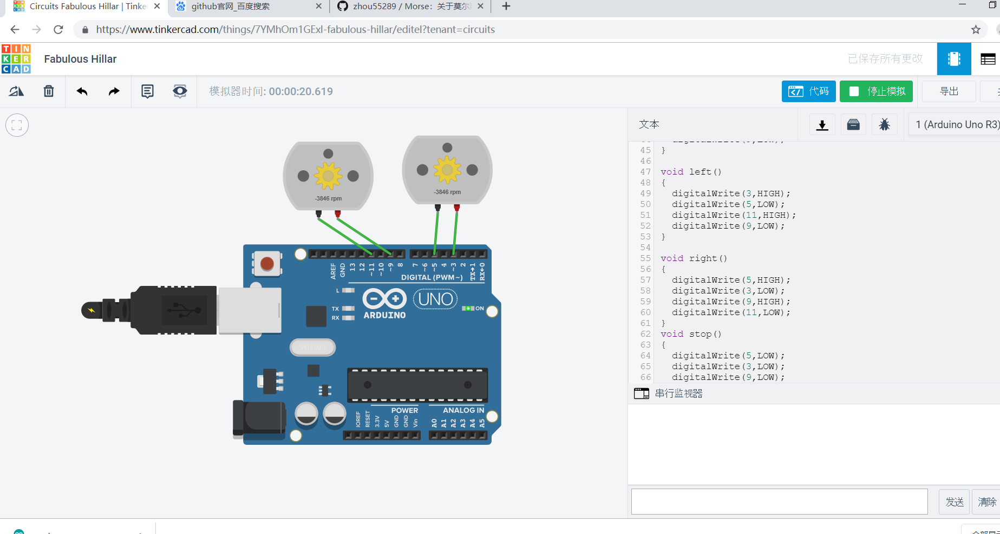
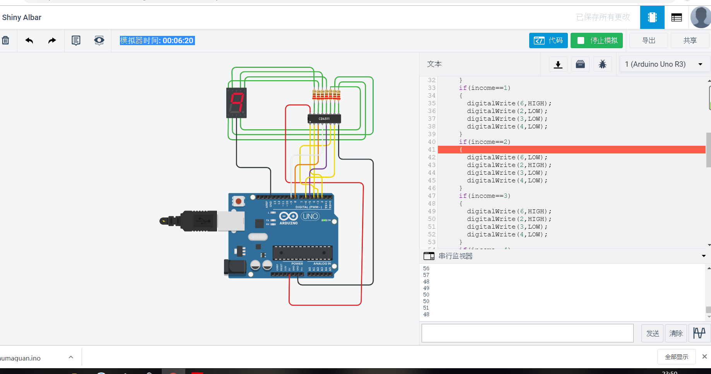
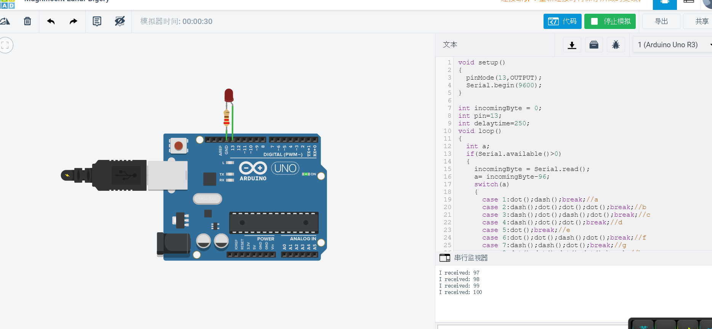

# 周靖鹏的开源硬件作业

## 第一天

#### 学习内容
·为什么要学习开源硬件
·如何学习开源硬件
·三个软件
	arduino

	fritzing

	processing

·几个常用网站
[arduino网址](http://arduino.cc)
[fritzing网址](https://fritzing.org)
[processing网址](https://processing.org)

## 第二天

arduino编程

七月三日作业
摩斯密码

···c
#ifndef _MORSE_H
#define _MORSE_H
class Morse
{
  public:
    Morse(int pin);
    void dot();
    void dash();
    void c_space();
    void w_space();
  private:
    int _pin;
    int _dottime;
};
#endif /*_MORSE_H*/

#include "Arduino.h"
#include "Morse.h"

Morse::Morse(int pin)
{
	pinMode(pin,OUTPUT);
	_pin=pin;
	_dottime=250;
}

void Morse::dot()
{
	digitalWrite(_pin,HIGH);
	delay(_dottime);
	digitalWrite(_pin,LOW);
	delay(_dottime);
}

void Morse::dash()
{
	digitalWrite(_pin,HIGH);
	delay(_dottime*4);
	digitalWrite(_pin,LOW);
	delay(_dottime);
}

void Morse::c_space()
{
	digitalWrite(_pin,LOW);
	delay(_dottime*3);
}

void Morse::w_space()
{
	digitalWrite(_pin,LOW);
	delay(_dottime*7);
}

#include <Morse.h>
Morse morse(13);

int incomingByte = 0;

void setup()
{
  Serial.begin(9600);
}

void loop()
{
  int a;
  if(Serial.available()>0)
  {
    incomingByte = Serial.read();
    a= incomingByte-96;
    switch(a)
    {
      case 1:morse.dot();morse.dash();break;//a
      case 2:morse.dash();morse.dot();morse.dot();morse.dot();break;//b
      case 3:morse.dash();morse.dot();morse.dash();morse.dot();break;//c
      case 4:morse.dash();morse.dot();morse.dot();break;//d
      case 5:morse.dot();break;//e
      case 6:morse.dot();morse.dot();morse.dash();morse.dot();break;//f
      case 7:morse.dash();morse.dash();morse.dot();break;//g
      case 8:morse.dot();morse.dot();morse.dot();morse.dot();break;//h
      case 9:morse.dot();morse.dot();break;//i
      case 10:morse.dot();morse.dash();morse.dash();morse.dash();break;//j
      case 11:morse.dash();morse.dot();morse.dash();break;//k
      case 12:morse.dot();morse.dash();morse.dot();morse.dot();break;//l
      case 13:morse.dash();morse.dash();break;//m
      case 14:morse.dash();morse.dot();break;//n
      case 15:morse.dash();morse.dash();morse.dash();break;//o
      case 16:morse.dot();morse.dash();morse.dash();morse.dot();break;//p
      case 17:morse.dash();morse.dash();morse.dot();morse.dash();break;//q
      case 18:morse.dot();morse.dash();morse.dot();break;//r
      case 19:morse.dot();morse.dot();morse.dot();break;//s
      case 20:morse.dash();break;//t
      case 21:morse.dot();morse.dot();morse.dash();break;//u
      case 22:morse.dot();morse.dot();morse.dot();morse.dash();break;//v
      case 23:morse.dot();morse.dash();morse.dash();break;//w
      case 24:morse.dash();morse.dot();morse.dot();morse.dash();break;//x
      case 25:morse.dash();morse.dot();morse.dash();morse.dash();break;//y
      case 26:morse.dash();morse.dash();morse.dot();morse.dot();;break;//z
      case -64:morse.c_space();break;//enter
      case -86:morse.w_space();break;//space
     }
    Serial.print("I received: ");
    Serial.println(incomingByte,DEC);
    }
  }
···

## 第三天

七月四日
课堂作业：小车电路图

[代码](car-0407/car.ino)

作业
四位数码管

[代码](七位数码管/shumaguan.ino)

## 第四天

七月五日
作业：Morse集合至一个项目中

[代码](Morse2.0/Morse2.0.ino)
